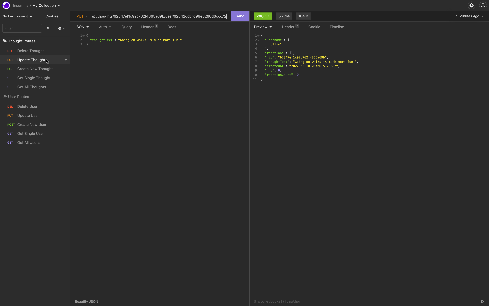

# Social Network APi Application

----

## Welcome to the Social Network API Application! 

### This application was developed to make it easy in sharing topics and thoughts with friends! 

---

### This application will allow you, as the User, to create and view all posts, edit posts, update, and delete them. You can also follow the same prompts for Thoughts on Posts as well. Creating and viewing all thoughts, updating, deleting them as well.

### Please have fun with this application and enjoy!

----

[Live Video Walkthrough](https://youtu.be/H4UDvbKad7E)

[GitHub Repository](https://github.com/jadehuynh/social-network-api)

----
## Screenshots of Application

----

### Get All Users

----

### Get Single User

----

### Create User

----

### Update User

----

### Delete User

----

### Get All Thoughts

----

### Get Single Thought

----

### Create Thought

----

### Update Thought

----

### Delete Thought

